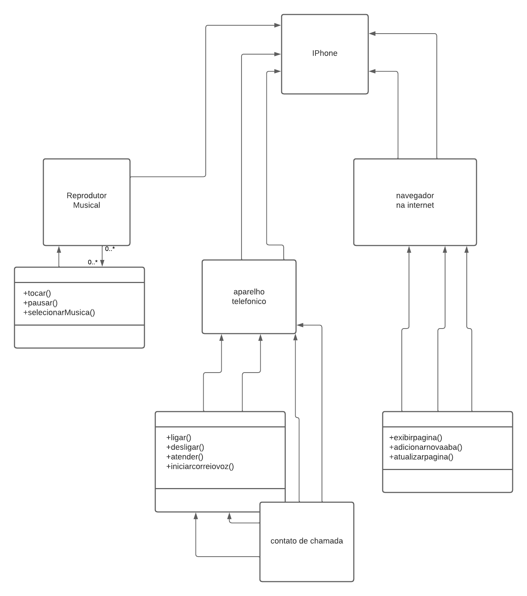

# Trilha Java Básico - Desafio Diagramacao do Iphone 

  

  Bootcamp Santander

## 💻 Desafio - Desafio Diagramacao do Iphone 

Chegou a hora de colocarmos em prática toda a concepção de análise de negócios, requisitos, conceitos da programação orientada a objetos e modelagem UML. Com base no vídeo de lançamento do iPhone conforme link abaixo, elabore em uma ferramenta de UML de sua preferência. A diagramação das classes e interfaces com a proposta de representar os papéis do iPhone de: Reprodutor Musical, Aparelho Telefônico e Navegador na Internet. Em seguida crie as classes e interfaces no formato de arquivos .java

## Modelo da diagramacao UML do Iphone 

  

